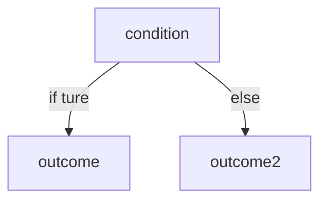
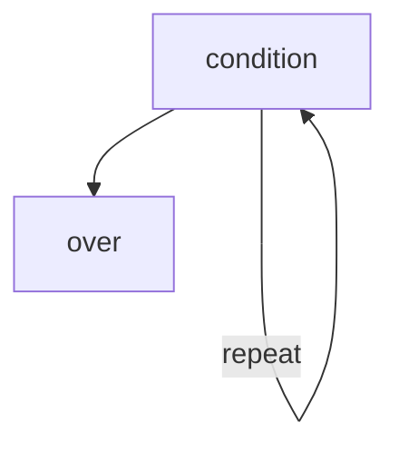

# Python day4

## Judgments & Conditions




``` python
year = 2022
if year > 2021:
    print("winter is coming")
else:
    print("you still in 2021")
```

We can put as much as possible elif in our code if we need

### Multi-layer options

``` python
statue = 'hungry'
if statue == 'hungry':
    toss = int(input("enter a number from 1-3:"))
    if toss == 1:
        print("pizza")
    elif toss == 2:
        print('burger')
    else:
        print('free meal day!')
else:
    print("you are not hungry yet")

```

## Circulation

### while




```python
i = 0
while i < 5:
    print("repeat 5 times")
    i += 1
print("over")
#-----------------------------------
#sum 1-100
i = 0
sum = 0
while i<100:
    i += 1
    sum +=i
print(sum) #5050
```

### for

```python
for a in 'python':
    print(a)
for b in["py","thon"]:
    print(b) #py
             #thon 
```

### Nested loops

``` python
infsos =[['1','2']['3','4']['5',6']]
for info in infos:
    for i in info:
        print(i)
```

Function: `enumerate()`

```python
infos =[
    ['1','2'],
    ['3','4'],
    ['5','6'],
]
for i,info in enumerate(infos):
    print(f"==================={i+1}============")
    for info in info:
        print(info)
```

## break & continues

### import random number

``` python
from random import randint


for i in range(10):
    score = randint(3, 10)
    print(f'number {i+1} is {score}')
    if score < 8:
        continue
    print("good")
```

``` python
for x in range(10):
if x==5:
break
print x
#
for x in range(10):
if x==5:
continue
print x
```

```python
i = 1
while True :
    if i == 5 :
        print('over')
        break
    print('keep')
    i +=1
```

break use for stop

continue use for skip
