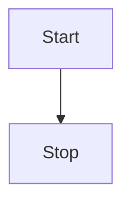

# picturing

## graph

| name |     mean      |
| :--: | :-----------: |
|  TB  | top to bottom |
|  BT  | bottom to top |
|  RL  | right to left |
|  LR  | left to right |



| expression | statement |      |
| ---------- | --------- | ---- |
| id[name]   | a         |      |
| id(name)   | b         |      |
| id((name)) | c         |      |
| id{name}   | d         |      |
| id>name]   | e         |      |
|            |           |      |

```mermaid
graph LR
A-->B[a]-->C(b)-->D((c))-->E{d}-->F>e]